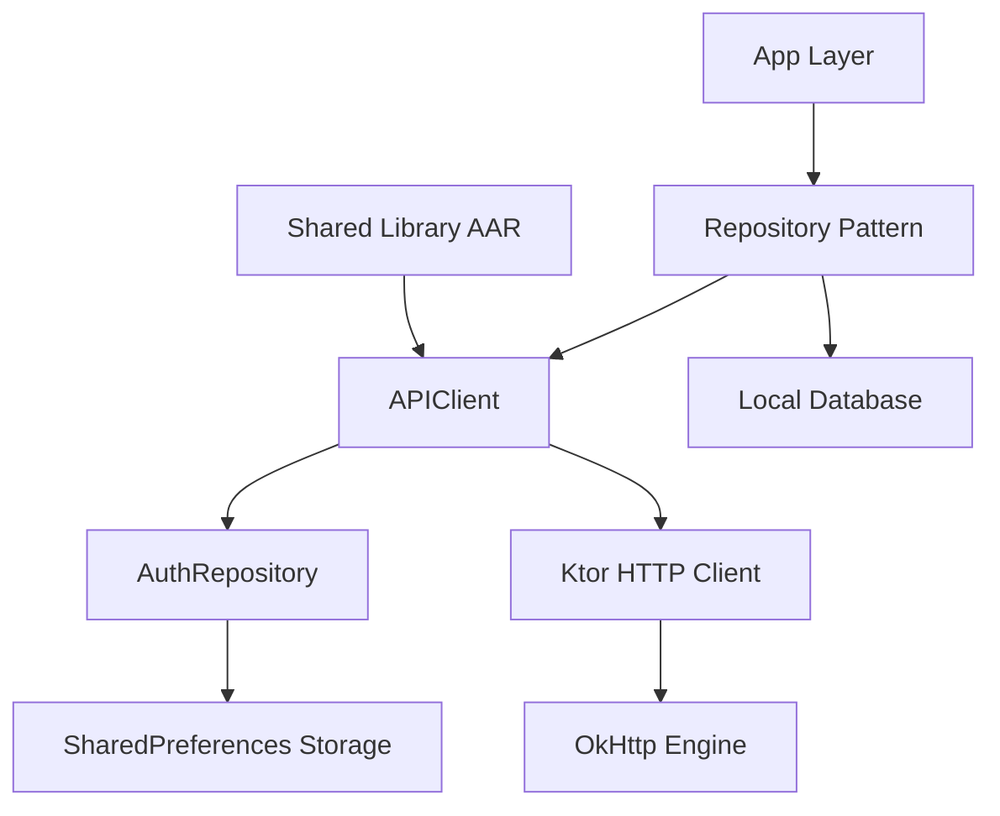
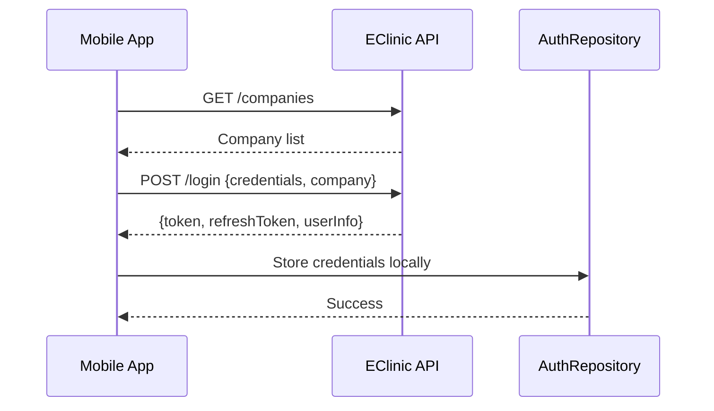
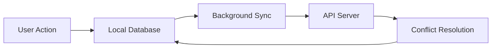

# API Architecture Documentation

## Overview

EClinic uses a sophisticated API architecture built on **Ktor client** with a **shared library approach** for networking. The architecture supports multi-tenant healthcare environments with robust offline capabilities and enterprise-grade security.

## Architecture Components

### 1. API Client Structure



### 2. Core Components

#### APIClient (Shared Library)
- **Location**: `ch.ticare.eclinic.library.network.APIClient`
- **Technology**: Ktor Client 2.3.4 with OkHttp engine
- **Features**: Content negotiation, logging, authentication handling

#### AuthRepository
- **Interface**: `ch.ticare.eclinic.library.network.AuthRepository`
- **Implementation**: `AuthRepositoryImpl.kt`
- **Storage**: SharedPreferences for persistent credentials

```kotlin
@Provides
@Singleton
fun provideApiService(authRepository: AuthRepository): APIClient {
    return APIClient(authRepository, LoginRedirect)
}
```

## Authentication Flow

### 1. Authentication Data Structure

```kotlin
// Authentication Storage
data class AuthData(
    val token: String,              // Access token
    val refreshToken: String,       // Refresh token
    val baseURL: String,           // API base URL
    val companyGroup: String,      // Multi-tenant group
    val companyName: String,       // Multi-tenant company
    val uuid: String,              // Device identifier
    val username: String?,         // Optional credential storage
    val password: String?          // Optional credential storage
)
```

### 2. Login Process



### 3. Token Management

#### Automatic Refresh
```kotlin
object LoginRedirect: CredentialsListener {
    var onCredentialRefresh: (() -> Unit)? = null
    
    override fun needCredentialsRefresh() {
        onCredentialRefresh?.invoke()
    }
}
```

#### Session Management
- Automatic token refresh on expiry
- Centralized logout handling
- Session validation across app lifecycle

## API Endpoints

### Base URL Structure
```
{baseURL}/api/v1/{endpoint}
```

### Environment Configuration

| Environment | Application ID | Purpose |
|-------------|---------------|---------|
| develop | `ch.ticare.eclinic.app.dev` | Development testing |
| preProd | `ch.ticare.eclinic.app` | Pre-production staging |
| mdm | `ch.ticare.eclinic.app.mdm` | Enterprise deployment |

### Multi-Tenant Support
- **Company-based routing**: Different organizations use same infrastructure
- **Dynamic base URLs**: Configurable per deployment
- **MDM integration**: Enterprise-managed configuration

## Repository Pattern

### Architecture
```kotlin
class ExampleRepository(
    private val apiClient: APIClient,
    private val database: Database,
    private val offlineOnlineRepository: OfflineOnlineRepository
) {
    suspend fun getData(): Flow<List<DataModel>> {
        return combine(
            getLocalData(),
            syncWithRemote()
        ) { local, remote -> 
            mergeData(local, remote)
        }
    }
}
```

### Repository Types

| Repository | Purpose | API Integration |
|------------|---------|-----------------|
| UserRepository | Authentication & user data | Login, profile, preferences |
| DiaryRepository | Patient activity logs | CRUD operations with sync |
| WoundRepository | Wound management | Image upload, assessments |
| SyncDataRepository | Data synchronization | Bulk operations, conflict resolution |

## Network Configuration

### Ktor Client Setup
```kotlin
dependencies {
    implementation("io.ktor:ktor-client-core:2.3.4")
    implementation("io.ktor:ktor-client-logging:2.3.4") 
    implementation("io.ktor:ktor-client-content-negotiation:2.3.4")
    implementation("io.ktor:ktor-serialization-kotlinx-json:2.3.4")
    implementation("io.ktor:ktor-client-okhttp:2.3.4")
}
```

### Features
- **Content Negotiation**: Automatic JSON serialization/deserialization
- **Request Logging**: Configurable logging for debugging
- **Connection Pooling**: Optimized through OkHttp
- **Timeout Configuration**: Customizable per request type

## Error Handling

### Error Response Structure
```kotlin
data class ErrorResponse(
    val code: Int,
    val desc: String,
    val details: Map<String, Any>?
)
```

### Error Handling Patterns

#### Repository Level
```kotlin
try {
    val response = apiClient.getData()
    return Result.success(response)
} catch (exception: Exception) {
    return when (exception) {
        is UnauthorizedException -> Result.failure(AuthError())
        is NetworkException -> Result.failure(NetworkError())
        else -> Result.failure(UnknownError(exception))
    }
}
```

#### ViewModel Level
```kotlin
private val exceptionHandler = CoroutineExceptionHandler { _, throwable ->
    isLoading.value = false
    errorMessage.value = when (throwable) {
        is AuthException -> "Please log in again"
        is NetworkException -> "Check your internet connection"
        else -> throwable.localizedMessage
    }
}
```

## Offline/Sync Architecture

### Offline-First Strategy


### Sync Patterns

#### Data Priority
1. **Local First**: All operations save locally immediately
2. **Background Sync**: Periodic upload when connectivity available
3. **Conflict Resolution**: Server-side conflict resolution with client merge

#### Sync Repository
```kotlin
class SyncDataRepository(
    private val apiClient: APIClient,
    private val database: Database,
    private val localStorage: LocalStorageImpl,
    private val offlineRepository: OfflineOnlineRepository
) {
    suspend fun syncPendingData(): SyncResult {
        val pendingItems = offlineRepository.getPendingSync()
        return processBatchSync(pendingItems)
    }
}
```

## Security Implementation

### Network Security
- **HTTPS Enforcement**: All API communication over TLS
- **Certificate Validation**: Standard Android certificate pinning
- **Token Security**: Secure storage in SharedPreferences
- **Request Signing**: Device UUID for request identification

### Data Protection
```kotlin
// Example of secure credential storage
class AuthRepositoryImpl(context: Context) : AuthRepository {
    private val prefs = context.getSharedPreferences(
        "auth_prefs", 
        Context.MODE_PRIVATE
    )
    
    override fun saveToken(token: String) {
        prefs.edit()
            .putString("access_token", token)
            .apply()
    }
}
```

## Enterprise Features

### MDM Integration
```xml
<!-- app_restrictions.xml -->
<restrictions>
    <restriction
        android:key="base_url"
        android:restrictionType="string"
        android:title="API Base URL"
        android:description="Server endpoint for API communication" />
</restrictions>
```

### Configuration Management
- **Runtime Configuration**: Base URL and tenant settings
- **Enterprise Policies**: MDM-enforced configurations
- **Environment Switching**: Build-time flavor configuration

## Monitoring & Logging

### Logging Framework
```kotlin
// Custom logger implementation
class MyLogger : ECLogger {
    override fun log(level: LogLevel, message: String, throwable: Throwable?) {
        when (level) {
            LogLevel.DEBUG -> Log.d(TAG, message, throwable)
            LogLevel.ERROR -> Log.e(TAG, message, throwable)
            // Send to Crashlytics for production
        }
    }
}
```

### Monitoring Tools
- **Firebase Crashlytics**: Error reporting and crash analytics
- **Logback**: Structured logging with file output
- **Network Logging**: Request/response debugging

## Performance Optimization

### Connection Management
- **Connection Pooling**: Reuse HTTP connections
- **Request Batching**: Combine related API calls
- **Caching Strategy**: Local cache with TTL policies

### Data Efficiency
- **Pagination**: Large datasets loaded incrementally  
- **Differential Sync**: Only sync changed data
- **Compression**: Gzip compression for large payloads

## Development Guidelines

### API Client Usage
```kotlin
// Recommended pattern
class FeatureRepository @Inject constructor(
    private val apiClient: APIClient,
    private val database: Database
) {
    suspend fun fetchData(): Result<List<DataModel>> {
        return try {
            val remoteData = apiClient.getData()
            database.insertData(remoteData)
            Result.success(remoteData)
        } catch (e: Exception) {
            val localData = database.getCachedData()
            if (localData.isNotEmpty()) {
                Result.success(localData)
            } else {
                Result.failure(e)
            }
        }
    }
}
```

### Error Handling Best Practices
1. **Graceful Degradation**: Fall back to cached data
2. **User-Friendly Messages**: Translate technical errors
3. **Retry Logic**: Implement exponential backoff
4. **Offline Indicators**: Show connection status

### Testing API Layer
```kotlin
// Repository testing with MockK
@Test
fun `fetchData returns cached data when network fails`() = runTest {
    // Given
    every { apiClient.getData() } throws NetworkException()
    every { database.getCachedData() } returns cachedData
    
    // When
    val result = repository.fetchData()
    
    // Then
    assertTrue(result.isSuccess)
    assertEquals(cachedData, result.getOrNull())
}
```

This API architecture provides a robust foundation for healthcare applications requiring high reliability, security, and offline capabilities.