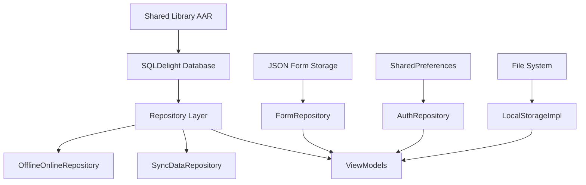

# Database Schema Documentation

## Overview

EClinic uses **SQLDelight 2.0.0** for database operations with an **offline-first architecture**. The database schema is implemented in a shared library (KMM) and provides comprehensive healthcare data management with sophisticated sync capabilities.

## Technology Stack

### Core Database Dependencies
```kotlin
implementation("app.cash.sqldelight:android-driver:2.0.0")
implementation("app.cash.sqldelight:sqlite-driver:2.0.0") 
implementation("app.cash.sqldelight:primitive-adapters:2.0.0")
implementation("app.cash.sqldelight:coroutines-extensions:2.0.0")
```

### Database Configuration
```kotlin
@Provides
@Singleton
fun provideDatabase(@ApplicationContext context: Context): Database {
    return createDatabase(DriverFactory(context))
}
```

## Architecture Overview



## Data Persistence Layers

### 1. SQLDelight Database (Shared Library)

The main database resides in the shared library and handles core healthcare entities:

#### Entity Categories

**Patient Management:**
- `CaseInfo` - Patient case information
- `CaseDetail` - Detailed patient medical information  
- `Zone`, `Microzone`, `Division`, `Sector` - Organizational hierarchy

**Medical Records:**
- `Wound` - Wound tracking and documentation
- `WoundPhoto` - Medical photography
- `AgendaTask` - Scheduled medical tasks
- `VitalParameter` - Patient vital signs

**Organizational:**
- `Tool` - Medical tools and equipment
- `OfflineSection` - Data sections for offline management
- `OfflineCreatedDataType` - Types of offline-created content

#### Repository Pattern Implementation

```kotlin
class ExampleRepository(
    private val apiClient: APIClient,
    private val database: Database,
    private val offlineOnlineRepository: OfflineOnlineRepository
) {
    fun getPatientData(patientId: String): Flow<List<PatientData>> {
        return database.patientQueries
            .selectByPatientId(patientId)
            .asFlow()
            .mapToList()
    }
}
```

### 2. JSON-Based Form Storage

Healthcare assessment forms use JSON persistence for flexibility:

#### Form Data Structure
```kotlin
@Serializable
data class CBIForm(
    val id: String = UUID.randomUUID().toString(),
    val creationDate: Long = System.currentTimeMillis(),
    val lastModified: Long = System.currentTimeMillis(),
    val patientData: PatientData = PatientData(),
    val caregiverData: CaregiverData = CaregiverData(),
    val sections: List<CBISection> = emptyList(),
    val totalScore: Int = 0,
    val compilationTimestamp: Long = System.currentTimeMillis(),
    val formType: String = "CBI"
)
```

#### Form Storage Files
| Form Type | Storage File | Purpose |
|-----------|--------------|---------|
| CBI | `cbi_forms.json` | Caregiver Burden Inventory |
| COMID | `comid_forms.json` | Multidimensional assessment |
| IPOS3gg | `ipos_3gg_forms.json` | 3-day palliative care outcome |
| IPOS7gg | `ipos_7gg_forms.json` | 7-day palliative care outcome |
| Senior Sitting | `senior_sitting_*.json` | Elderly care assessments |

#### Form Repository Implementation
```kotlin
class FormRepositoryImpl(
    private val jsonDataSource: JsonDataSource
) : FormRepository {
    override fun getAllForms(): Flow<List<CBIForm>> {
        return jsonDataSource.getForms()
    }
    
    override suspend fun saveForm(form: CBIForm) {
        jsonDataSource.saveForm(form)
    }
}
```

### 3. SharedPreferences (Authentication)

Authentication and configuration data stored in SharedPreferences:

```kotlin
class AuthRepositoryImpl(context: Context) : AuthRepository {
    private val prefs = context.getSharedPreferences("auth_prefs", Context.MODE_PRIVATE)
    
    override fun saveAuthData(authData: AuthData) {
        prefs.edit()
            .putString("access_token", authData.token)
            .putString("refresh_token", authData.refreshToken)
            .putString("base_url", authData.baseURL)
            .putString("company_group", authData.companyGroup)
            .putString("company_name", authData.companyName)
            .putString("device_uuid", authData.uuid)
            .apply()
    }
}
```

#### Stored Authentication Data
- `access_token` - API access token
- `refresh_token` - Token refresh credential
- `base_url` - API server endpoint
- `company_group` - Multi-tenant group identifier
- `company_name` - Multi-tenant company identifier
- `device_uuid` - Unique device identifier
- `username/password` - Optional credential storage

### 4. File System Storage

Media files and images managed through `LocalStorageImpl`:

```kotlin
class LocalStorageImpl(private val context: Context) : LocalStorageApi {
    private val imagesDir = context.getDir("images", Context.MODE_PRIVATE)
    
    suspend fun saveImage(uri: Uri, filename: String): String {
        val encodedFilename = URLEncoder.encode(filename, "UTF-8")
        val file = File(imagesDir, encodedFilename)
        // Save image logic
        return file.absolutePath
    }
}
```

## Offline/Sync Architecture

### OfflineOnlineRepository

Manages offline state and sync coordination:

```kotlin
class OfflineOnlineRepository(
    private val database: Database,
    private val logger: ECLogger
) {
    // Track downloaded patients
    private val downloadedPatients = mutableSetOf<String>()
    
    // Track modified patients requiring sync
    private val modifiedPatients = mutableSetOf<String>()
    
    // Track online/offline state
    private var isOnline = false
    
    fun markPatientAsDownloaded(patientCode: String) {
        downloadedPatients.add(patientCode)
    }
    
    fun markPatientAsModified(patientCode: String) {
        modifiedPatients.add(patientCode)
    }
}
```

### Sync Data Types

```kotlin
enum class OfflineCreatedDataType {
    // Wound Management
    WOUND_CREATE,
    WOUND_UPDATE, 
    WOUND_ADD_IMAGE,
    
    // Task Management
    AGENDA_UPDATE_TASK,
    AGENDA_ADD_UNSCHEDULED,
    
    // Services
    OTHER_SERVICE_CREATE,
    NURSING_CREATE,
    
    // Care Plans
    PLANS_CREATE,
    
    // User Actions
    USER_MARKING_ADD,
    
    // Vital Parameters
    VITAL_PARAMETER_CREATE,
    
    // And many more...
}
```

### Sync Repository Pattern

```kotlin
class SyncDataRepository(
    private val apiClient: APIClient,
    private val database: Database,
    private val localStorage: LocalStorageImpl,
    private val offlineRepository: OfflineOnlineRepository,
    private val authRepository: AuthRepository,
    private val logger: ECLogger
) {
    suspend fun syncOfflineData(): SyncResult {
        val pendingData = offlineRepository.getPendingSync()
        
        return try {
            val results = pendingData.map { data ->
                when (data.type) {
                    WOUND_CREATE -> syncWoundCreation(data)
                    WOUND_UPDATE -> syncWoundUpdate(data)
                    AGENDA_UPDATE_TASK -> syncTaskUpdate(data)
                    // Handle all sync types...
                    else -> SyncResult.Skipped
                }
            }
            
            SyncResult.Success(results)
        } catch (e: Exception) {
            logger.log(LogLevel.ERROR, "Sync failed", e)
            SyncResult.Error(e)
        }
    }
}
```

## Database Schema (Inferred)

Based on repository usage patterns and entity references:

### Core Tables

#### Patient Management
```sql
-- Patients/Cases table (inferred)
CREATE TABLE cases (
    code TEXT PRIMARY KEY,
    first_name TEXT,
    last_name TEXT,
    birth_date TEXT,
    gender TEXT,
    zone_id TEXT,
    microzone_id TEXT,
    division_id TEXT,
    sector_id TEXT,
    status TEXT,
    created_at INTEGER,
    modified_at INTEGER
);

-- Organizational hierarchy
CREATE TABLE zones (
    id TEXT PRIMARY KEY,
    name TEXT,
    created_at INTEGER
);

CREATE TABLE microzones (
    id TEXT PRIMARY KEY,
    zone_id TEXT,
    name TEXT,
    FOREIGN KEY (zone_id) REFERENCES zones(id)
);
```

#### Medical Records
```sql
-- Wounds tracking
CREATE TABLE wounds (
    id TEXT PRIMARY KEY,
    patient_code TEXT,
    location TEXT,
    status TEXT,
    created_at INTEGER,
    modified_at INTEGER,
    FOREIGN KEY (patient_code) REFERENCES cases(code)
);

-- Wound photos
CREATE TABLE wound_photos (
    id TEXT PRIMARY KEY,
    wound_id TEXT,
    file_path TEXT,
    created_at INTEGER,
    FOREIGN KEY (wound_id) REFERENCES wounds(id)
);

-- Scheduled tasks
CREATE TABLE agenda_tasks (
    id TEXT PRIMARY KEY,
    patient_code TEXT,
    task_type TEXT,
    scheduled_date INTEGER,
    status TEXT,
    created_at INTEGER,
    FOREIGN KEY (patient_code) REFERENCES cases(code)
);
```

#### Sync Management
```sql
-- Offline data tracking
CREATE TABLE offline_sync_data (
    id TEXT PRIMARY KEY,
    patient_code TEXT,
    data_type TEXT,
    json_data TEXT,
    created_at INTEGER,
    sync_status TEXT
);

-- Modification tracking
CREATE TABLE patient_modifications (
    patient_code TEXT PRIMARY KEY,
    modified_at INTEGER,
    sync_required INTEGER DEFAULT 1
);
```

## Data Access Patterns

### Reactive Data Flow
```kotlin
class PatientRepository {
    fun getPatientFlow(patientCode: String): Flow<PatientDetails?> {
        return database.patientQueries
            .selectPatientByCode(patientCode)
            .asFlow()
            .mapToOneOrNull()
            .combine(getPatientWounds(patientCode)) { patient, wounds ->
                patient?.copy(wounds = wounds)
            }
    }
}
```

### Error Handling
```kotlin
class RepositoryBase {
    protected suspend fun <T> safeApiCall(
        apiCall: suspend () -> T
    ): Result<T> {
        return try {
            Result.success(apiCall())
        } catch (e: Exception) {
            logger.log(LogLevel.ERROR, "API call failed", e)
            Result.failure(e)
        }
    }
}
```

## Performance Optimizations

### 1. Connection Pooling
SQLDelight uses connection pooling for optimal performance:
```kotlin
val driver = AndroidSqliteDriver(
    schema = Database.Schema,
    context = context,
    name = "eclinic.db"
)
```

### 2. Lazy Loading
```kotlin
fun getPatientDetails(patientCode: String): Flow<PatientDetails> {
    return database.patientQueries
        .selectPatientByCode(patientCode)
        .asFlow()
        .mapToOneOrNull()
        .filterNotNull()
        .distinctUntilChanged()
}
```

### 3. Batch Operations
```kotlin
suspend fun bulkInsertWounds(wounds: List<Wound>) {
    database.transaction {
        wounds.forEach { wound ->
            database.woundQueries.insertWound(
                id = wound.id,
                patientCode = wound.patientCode,
                location = wound.location,
                status = wound.status
            )
        }
    }
}
```

## Migration Strategy

While migrations aren't visible in the app code (handled by shared library), best practices include:

### Version Management
```kotlin
object DatabaseVersion {
    const val CURRENT_VERSION = 1
    
    fun migrate(database: Database, oldVersion: Int, newVersion: Int) {
        when {
            oldVersion < 2 -> migrateToV2(database)
            oldVersion < 3 -> migrateToV3(database)
        }
    }
}
```

## Security Considerations

### Data Encryption
- **Database encryption**: Likely implemented in shared library
- **File encryption**: Sensitive files encrypted at rest
- **SharedPreferences**: Sensitive data should be encrypted

### Access Control
```kotlin
class SecureRepository {
    private fun requireAuthentication() {
        if (!authRepository.isAuthenticated()) {
            throw UnauthorizedException("User not authenticated")
        }
    }
    
    suspend fun getPatientData(patientCode: String): PatientData {
        requireAuthentication()
        return database.patientQueries.selectByCode(patientCode)
    }
}
```

This database architecture provides a robust foundation for offline-capable healthcare applications with sophisticated sync mechanisms and multi-layered data persistence strategies.