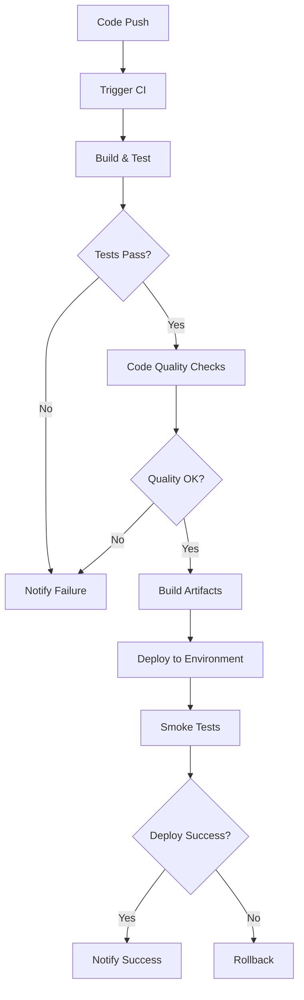
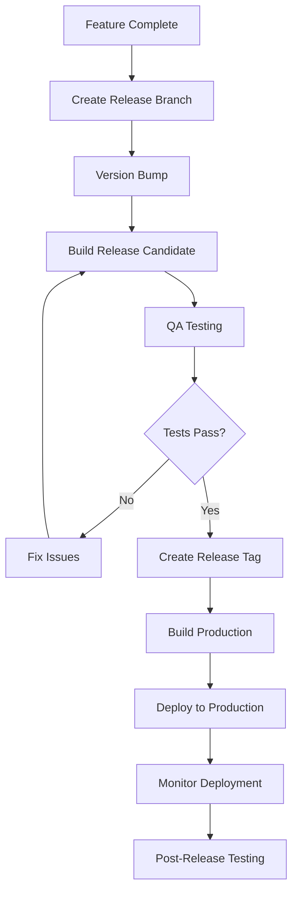
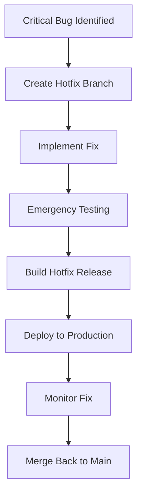

# Deployment and Build Process Documentation

## Overview

This document outlines the deployment strategies, build processes, and release procedures for the EClinic Android application. The app supports multiple environments and deployment targets including development, pre-production, and enterprise MDM environments.

## Build Configuration

### Project Structure

```
eclinic-android/
├── app/
│   ├── build.gradle              # Main app build configuration
│   ├── proguard-rules.pro       # Code obfuscation rules
│   └── src/
│       ├── main/                # Production source code
│       ├── debug/               # Debug-specific code
│       └── release/             # Release-specific code
├── build.gradle                 # Root project configuration
├── gradle.properties           # Global Gradle properties
├── settings.gradle             # Project settings
└── Keystore/                   # Signing keys (not in repository)
    ├── bitrise                 # CI/CD keystore
    └── credenziali            # Credential files
```

### Build Variants

The application supports three product flavors and two build types, creating six build variants:

#### Product Flavors

| Flavor | Application ID | Environment | Purpose |
|--------|---------------|-------------|---------|
| **develop** | `ch.ticare.eclinic.app.dev` | Development | Internal testing and development |
| **preProd** | `ch.ticare.eclinic.app` | Pre-production | Staging environment testing |
| **mdm** | `ch.ticare.eclinic.app.mdm` | Production MDM | Enterprise deployment with device management |

#### Build Types

| Build Type | Minification | Debugging | Purpose |
|------------|-------------|-----------|---------|
| **debug** | Disabled | Enabled | Development and testing |
| **release** | Disabled | Disabled | Production deployment |

#### Complete Build Variants

1. `developDebug` - Development testing
2. `developRelease` - Development release candidate
3. `preProdDebug` - Pre-production testing
4. `preProdRelease` - Pre-production release
5. `mdmDebug` - Enterprise testing
6. `mdmRelease` - Enterprise production

### Build Commands

#### Local Development

```bash
# Clean build
./gradlew clean

# Debug builds
./gradlew assembleDevelopDebug
./gradlew assemblePreProdDebug
./gradlew assembleMdmDebug

# Release builds
./gradlew assembleDevelopRelease
./gradlew assemblePreProdRelease
./gradlew assembleMdmRelease

# Install on connected device
./gradlew installDevelopDebug
./gradlew installPreProdDebug
./gradlew installMdmDebug

# Generate signed release builds
./gradlew bundleDevelopRelease
./gradlew bundlePreProdRelease
./gradlew bundleMdmRelease
```

#### Testing Commands

```bash
# Unit tests
./gradlew test
./gradlew testDevelopDebugUnitTest
./gradlew testPreProdDebugUnitTest

# Instrumented tests
./gradlew connectedAndroidTest
./gradlew connectedDevelopDebugAndroidTest

# Code coverage
./gradlew testDevelopDebugUnitTestCoverage
./gradlew createDevelopDebugCoverageReport
```

#### Quality Assurance

```bash
# Lint checks
./gradlew lint
./gradlew lintDevelopDebug
./gradlew lintPreProdRelease

# Code formatting
./gradlew ktlintCheck
./gradlew ktlintFormat

# Dependency updates
./gradlew dependencyUpdates
```

## Continuous Integration/Continuous Deployment (CI/CD)

### CI/CD Pipeline Overview



### Bitrise Configuration

The project uses Bitrise for CI/CD automation. Key configurations:

#### Workflow Triggers

```yaml
# Example bitrise.yml configuration
workflows:
  develop_build:
    steps:
    - activate-ssh-key: {}
    - git-clone: {}
    - gradle-runner:
        inputs:
        - gradle_task: assembleDevelopDebug testDevelopDebugUnitTest
    - deploy-to-bitrise-io: {}
    
  release_build:
    steps:
    - activate-ssh-key: {}
    - git-clone: {}
    - gradle-runner:
        inputs:
        - gradle_task: bundleMdmRelease
    - sign-apk: {}
    - deploy-to-bitrise-io: {}
```

#### Environment Variables

| Variable | Purpose | Example |
|----------|---------|---------|
| `BITRISE_APP_TITLE` | Application name | EClinic Android |
| `BITRISE_BUILD_NUMBER` | Build number | 83 |
| `BITRISEIO_ANDROID_KEYSTORE_URL` | Keystore URL | `$BITRISEIO_ANDROID_KEYSTORE_URL` |
| `BITRISEIO_ANDROID_KEYSTORE_ALIAS` | Key alias | `eclinic_key` |
| `BITRISEIO_ANDROID_KEYSTORE_PASSWORD` | Keystore password | `***` |

### Build Scripts

#### Pre-build Scripts

```bash
#!/bin/bash
# scripts/pre-build.sh

# Validate environment
echo "Validating build environment..."

# Check required environment variables
if [ -z "$ANDROID_HOME" ]; then
    echo "Error: ANDROID_HOME not set"
    exit 1
fi

# Verify keystore availability for release builds
if [ "$BUILD_TYPE" = "release" ]; then
    if [ ! -f "$KEYSTORE_PATH" ]; then
        echo "Error: Keystore not found for release build"
        exit 1
    fi
fi

# Update version code if needed
if [ -n "$BUILD_NUMBER" ]; then
    sed -i "s/versionCode .*/versionCode $BUILD_NUMBER/" app/build.gradle
fi

echo "Pre-build validation completed successfully"
```

#### Post-build Scripts

```bash
#!/bin/bash
# scripts/post-build.sh

# Generate build report
echo "Generating build report..."

# Create artifact directory
mkdir -p artifacts/

# Copy APK/AAB files
cp app/build/outputs/apk/*/*.apk artifacts/ 2>/dev/null || true
cp app/build/outputs/bundle/*/*.aab artifacts/ 2>/dev/null || true

# Generate checksums
cd artifacts/
for file in *.apk *.aab; do
    if [ -f "$file" ]; then
        sha256sum "$file" > "$file.sha256"
    fi
done

# Upload to artifact repository
if [ "$CI" = "true" ]; then
    echo "Uploading artifacts to repository..."
    # Upload logic here
fi

echo "Post-build processing completed"
```

## App Signing

### Keystore Management

#### Keystore Structure
```
Keystore/
├── eclinic-release.keystore     # Production keystore
├── eclinic-debug.keystore       # Development keystore
└── key.properties              # Keystore configuration
```

#### Keystore Configuration

```properties
# key.properties (not in repository)
storeFile=../Keystore/eclinic-release.keystore
storePassword=***
keyAlias=eclinic_key
keyPassword=***
```

#### Build Configuration

```gradle
// app/build.gradle
android {
    signingConfigs {
        debug {
            storeFile file('../Keystore/eclinic-debug.keystore')
            storePassword 'android'
            keyAlias 'androiddebugkey'
            keyPassword 'android'
        }
        release {
            if (project.hasProperty('storeFile')) {
                storeFile file(project.property('storeFile'))
                storePassword project.property('storePassword')
                keyAlias project.property('keyAlias')
                keyPassword project.property('keyPassword')
            }
        }
    }
    
    buildTypes {
        debug {
            signingConfig signingConfigs.debug
        }
        release {
            signingConfig signingConfigs.release
            minifyEnabled false
            proguardFiles getDefaultProguardFile('proguard-android-optimize.txt'), 'proguard-rules.pro'
        }
    }
}
```

### Security Best Practices

#### Keystore Security
- **Never commit keystores to repository**
- **Use secure CI/CD environment variables**
- **Rotate keys periodically**
- **Maintain backup copies securely**

#### Code Obfuscation

```proguard
# proguard-rules.pro
-keep class ch.ticare.eclinic.library.** { *; }
-keep class it.airbagstudio.ticare.data.** { *; }

# Preserve serialization classes
-keepclassmembers class * implements java.io.Serializable {
    static final long serialVersionUID;
    private static final java.io.ObjectStreamField[] serialPersistentFields;
    private void writeObject(java.io.ObjectOutputStream);
    private void readObject(java.io.ObjectInputStream);
}

# Firebase
-keep class com.google.firebase.** { *; }
-dontwarn com.google.firebase.**

# Ktor
-keep class io.ktor.** { *; }
-dontwarn io.ktor.**
```

## Deployment Strategies

### Environment-Specific Deployment

#### Development Environment

**Purpose**: Internal testing and development

**Process**:
1. Automatic builds on feature branch pushes
2. Deploy to internal testing devices
3. Smoke testing by development team
4. No formal approval required

**Commands**:
```bash
# Build and deploy development version
./gradlew assembleDevelopDebug
./gradlew installDevelopDebug

# Or via Bitrise
bitrise run develop_build
```

#### Pre-Production Environment

**Purpose**: Staging environment for QA testing

**Process**:
1. Builds triggered on `develop` branch merges
2. Deploy to QA testing environment
3. Comprehensive testing by QA team
4. Stakeholder approval required

**Commands**:
```bash
# Build pre-production release
./gradlew assemblePreProdRelease
./gradlew bundlePreProdRelease
```

#### Production Environment (MDM)

**Purpose**: Enterprise deployment with Mobile Device Management

**Process**:
1. Builds triggered on `main` branch tags
2. Full regression testing
3. Security scanning
4. Deploy to enterprise MDM system
5. Staged rollout to user groups

**Commands**:
```bash
# Build production release
./gradlew assembleMdmRelease
./gradlew bundleMdmRelease

# Verify signature
jarsigner -verify -verbose app/build/outputs/bundle/mdmRelease/app-mdm-release.aab
```

### Release Management

#### Version Management

**Version Naming Convention**:
- **Major.Minor.Patch** (e.g., 1.2.18)
- **Major**: Breaking changes or major features
- **Minor**: New features, backwards compatible
- **Patch**: Bug fixes and minor improvements

**Version Code**: Incremental integer (current: 83)

```gradle
android {
    defaultConfig {
        versionCode 83
        versionName "1.2.18"
    }
}
```

#### Release Process



#### Release Checklist

**Pre-Release**:
- [ ] All tests passing
- [ ] Code review completed
- [ ] Version numbers updated
- [ ] Release notes prepared
- [ ] Staging deployment successful
- [ ] Security scan completed

**Release**:
- [ ] Production build created
- [ ] APK/AAB signed correctly
- [ ] Deployment to MDM system
- [ ] Initial smoke tests passed
- [ ] Monitoring systems active

**Post-Release**:
- [ ] User acceptance testing
- [ ] Performance monitoring
- [ ] Error tracking review
- [ ] User feedback collection
- [ ] Hotfix process ready

## Distribution Channels

### Internal Distribution

#### Development Team
- **Method**: Direct APK installation
- **Access**: All team members
- **Updates**: Automatic via CI/CD

#### QA Team
- **Method**: Bitrise deployment
- **Access**: QA team members
- **Updates**: On develop branch changes

### Production Distribution

#### Enterprise MDM
- **Method**: MDM system deployment
- **Access**: Authorized healthcare professionals
- **Updates**: Controlled rollout via MDM policies

**MDM Configuration**:
```xml
<!-- app_restrictions.xml -->
<restrictions>
    <restriction
        android:key="base_url"
        android:restrictionType="string"
        android:title="API Base URL"
        android:description="Server endpoint for API communication" />
    
    <restriction
        android:key="company_code"
        android:restrictionType="string"
        android:title="Company Code"
        android:description="Organization identifier" />
</restrictions>
```

## Monitoring and Analytics

### Build Monitoring

#### Build Health Metrics
- **Build Success Rate**: Target > 95%
- **Build Time**: Target < 10 minutes
- **Test Coverage**: Target > 80%
- **Code Quality Score**: Target > A grade

#### Monitoring Tools
```bash
# Build time tracking
./gradlew build --profile

# Dependency analysis
./gradlew dependencyInsight --dependency androidx.compose:compose-bom

# APK analysis
./gradlew analyzeDebugBundle
```

### Deployment Monitoring

#### Key Metrics
- **Deployment Success Rate**
- **Rollback Frequency**
- **Time to Deploy**
- **User Adoption Rate**

#### Alerts and Notifications

**Slack Integration**:
```json
{
  "text": "EClinic Android Deployment",
  "attachments": [
    {
      "color": "good",
      "fields": [
        {
          "title": "Version",
          "value": "1.2.18 (83)",
          "short": true
        },
        {
          "title": "Environment",
          "value": "Production MDM",
          "short": true
        }
      ]
    }
  ]
}
```

## Troubleshooting

### Common Build Issues

#### Gradle Sync Failures
```bash
# Clear Gradle cache
./gradlew clean
rm -rf .gradle/
./gradlew --refresh-dependencies

# Reset Android Studio
File → Invalidate Caches and Restart
```

#### Signing Issues
```bash
# Verify keystore
keytool -list -v -keystore Keystore/eclinic-release.keystore

# Check signing configuration
./gradlew signingReport
```

#### Memory Issues
```bash
# Increase Gradle memory
echo "org.gradle.jvmargs=-Xmx4g -XX:MaxMetaspaceSize=512m" >> gradle.properties

# Enable parallel builds
echo "org.gradle.parallel=true" >> gradle.properties
```

### Deployment Issues

#### MDM Deployment Failures
1. **Check app restrictions configuration**
2. **Verify signing certificate matches MDM policy**
3. **Validate minimum API level compatibility**
4. **Review enterprise app approval status**

#### Network-Related Issues
1. **Verify API endpoint accessibility**
2. **Check certificate pinning configuration**
3. **Validate network security policies**
4. **Test offline mode functionality**

## Emergency Procedures

### Hotfix Process



### Rollback Procedures

#### Immediate Rollback
```bash
# Revert to previous version via MDM
mdm-cli rollback --app eclinic --version 1.2.17
```

#### Graduated Rollback
1. **Stop new deployments**
2. **Revert subset of users**
3. **Monitor system stability**
4. **Complete rollback if necessary**

### Incident Response

#### Severity Levels

| Level | Description | Response Time | Escalation |
|-------|-------------|---------------|------------|
| **P0** | Complete service outage | 15 minutes | CTO, VP Engineering |
| **P1** | Critical functionality broken | 1 hour | Engineering Manager |
| **P2** | Important feature impacted | 4 hours | Team Lead |
| **P3** | Minor issues | 24 hours | Developer |

This comprehensive deployment documentation ensures reliable, secure, and efficient delivery of the EClinic Android application across all environments.