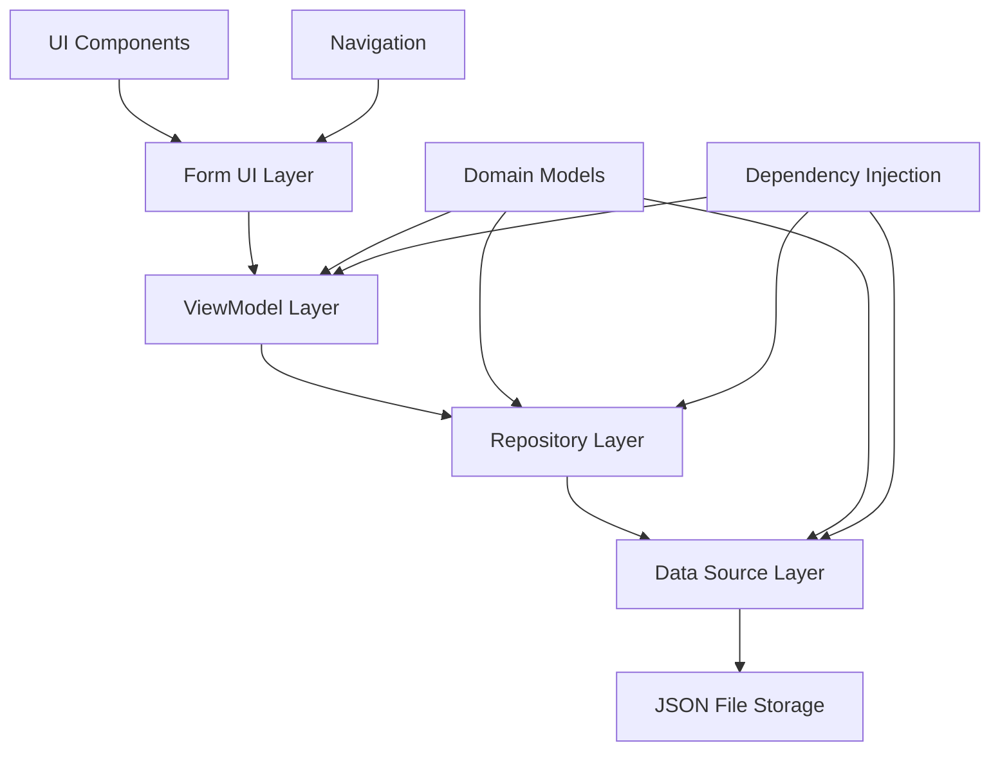
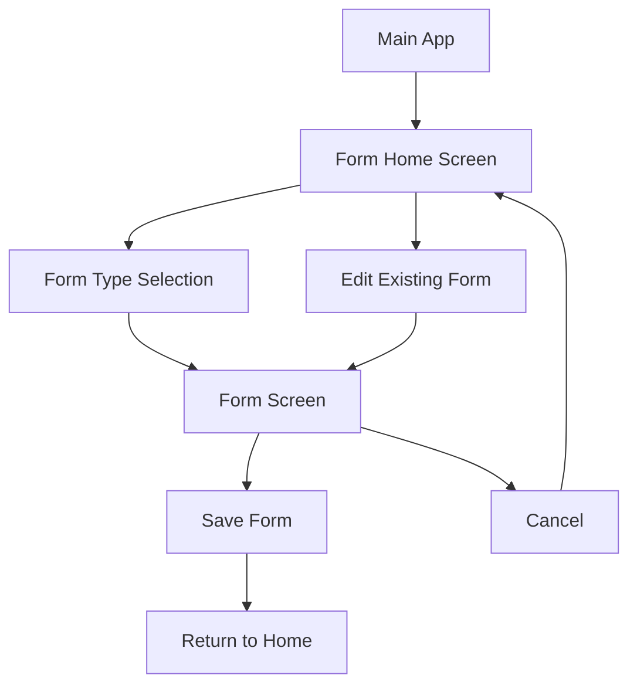

# Form System Architecture Documentation

## Overview

The EClinic Android application includes a sophisticated form system for managing various medical assessment forms. This system handles CBI (Caregiver Burden Inventory), COMID, IPOS scales, and Senior Sitting assessments using clean architecture principles with domain-driven design.

## Architecture Overview



## Project Structure

```
pages/patientDetails/form/
├── data/
│   ├── datasource/
│   │   ├── JsonDataSource.kt              # Data source interface
│   │   └── local/
│   │       └── JsonDataSourceImpl.kt      # Local JSON implementation
│   └── repository/
│       └── FormRepositoryImpl.kt          # Repository implementation
├── domain/
│   ├── model/                             # Domain entities
│   │   ├── CBIForm.kt                     # CBI form model
│   │   ├── COMIDForm.kt                   # COMID form model
│   │   ├── IPOS3ggForm.kt                 # IPOS 3-day model
│   │   ├── IPOS7ggForm.kt                 # IPOS 7-day model
│   │   ├── SeniorSittingAdesioneForm.kt   # Senior sitting adhesion
│   │   ├── SeniorSittingNonAdesioneForm.kt # Senior sitting non-adhesion
│   │   ├── PatientData.kt                 # Patient information
│   │   ├── QuestionResponse.kt            # Question/answer structure
│   │   └── Caregiver.kt                   # Caregiver information
│   ├── data/                              # Static form definitions
│   │   ├── CbiQuestions.kt                # CBI question definitions
│   │   ├── ComidQuestions.kt              # COMID question definitions
│   │   └── ...                           # Other form questions
│   └── repository/
│       └── FormRepository.kt              # Repository interface
├── di/
│   └── FormRepositoryProvider.kt          # Dependency injection
└── ui/
    ├── components/                        # Reusable UI components
    ├── factories/                         # ViewModel factories
    ├── forms/                             # Form-specific screens
    ├── home/                              # Home screen
    ├── navigation/                        # Navigation setup
    └── theme/                             # Form theming
```

## Core Components

### 1. Domain Models

#### Base Form Structure

All forms follow a consistent structure pattern:

```kotlin
@Serializable
data class CBIForm(
    val id: String = UUID.randomUUID().toString(),
    val creationDate: Long = System.currentTimeMillis(),
    val lastModified: Long = System.currentTimeMillis(),
    val patientData: PatientData = PatientData(),
    val caregiverData: CaregiverData = CaregiverData(),
    val sections: List<CBISection> = emptyList(),
    val totalScore: Int = 0,
    val compilationTimestamp: Long = System.currentTimeMillis(),
    val formType: String = "CBI"
)
```

#### Section Structure

```kotlin
@Serializable
data class CBISection(
    val type: SectionType,
    val questions: List<QuestionResponse> = emptyList(),
    val partialScore: Int = 0,
    val correctionFactor: Float = when(type) {
        SectionType.PHYSICAL -> 1.25f  // Special correction for physical burden
        else -> 1.0f
    }
)

@Serializable
enum class SectionType {
    OBJECTIVE,      // Objective burden
    PSYCHOLOGICAL,  // Psychological burden
    PHYSICAL,       // Physical burden
    SOCIAL,         // Social burden
    EMOTIONAL       // Emotional burden
}
```

#### Question Response

```kotlin
@Serializable
data class QuestionResponse(
    val questionId: Int,
    val questionText: String,
    val score: Int? = null  // Nullable for unanswered questions
)
```

#### Patient Data

```kotlin
@Serializable
data class PatientData(
    val firstName: String = "",
    val lastName: String = "",
    val dateOfBirth: String = "",
    val compilationDate: String = "",
    val compilationTime: String = "",
    val compiledBy: String = "",
    val zone: String = ""  // Used by Senior Sitting forms
)
```

### 2. Data Persistence Layer

#### JSON Data Source

The form system uses JSON-based local storage for persistence:

```kotlin
interface JsonDataSource {
    suspend fun saveCBIForms(forms: List<CBIForm>)
    suspend fun loadCBIForms(): List<CBIForm>
    suspend fun saveCOMIDForms(forms: List<COMIDForm>)
    suspend fun loadCOMIDForms(): List<COMIDForm>
    // ... methods for all form types
}
```

#### Implementation Details

```kotlin
class JsonDataSourceImpl(private val context: Context) : JsonDataSource {
    private val cbiForms = mutableStateOf<List<CBIForm>>(emptyList())
    private val json = Json { 
        ignoreUnknownKeys = true 
        encodeDefaults = true
    }
    
    override suspend fun saveCBIForms(forms: List<CBIForm>) {
        withContext(Dispatchers.IO) {
            try {
                val jsonString = json.encodeToString(forms)
                context.openFileOutput(CBI_FORMS_FILENAME, Context.MODE_PRIVATE).use {
                    it.write(jsonString.toByteArray())
                }
                cbiForms.value = forms
            } catch (e: Exception) {
                // Handle error gracefully
            }
        }
    }
}
```

#### File Storage Structure

| Form Type | Filename | Purpose |
|-----------|----------|---------|
| CBI | `cbi_forms.json` | Caregiver Burden Inventory |
| COMID | `comid_forms.json` | Multidimensional assessment |
| IPOS3gg | `ipos_3gg_forms.json` | 3-day palliative care outcome |
| IPOS7gg | `ipos_7gg_forms.json` | 7-day palliative care outcome |
| Senior Sitting | `senior_sitting_adesione_forms.json` | Elderly care adhesion |
| Senior Sitting | `senior_sitting_non_adesione_forms.json` | Elderly care non-adhesion |

### 3. Repository Pattern

#### Repository Interface

```kotlin
interface FormRepository {
    // CBI Operations
    suspend fun saveCBIForm(form: CBIForm)
    fun getCBIForms(): Flow<List<CBIForm>>
    suspend fun getCBIFormById(formId: String): CBIForm?
    suspend fun deleteCBIForm(formId: String)
    
    // COMID Operations
    suspend fun saveCOMIDForm(form: COMIDForm)
    fun getCOMIDForms(): Flow<List<COMIDForm>>
    // ... similar patterns for all form types
}
```

#### Repository Implementation

```kotlin
class FormRepositoryImpl(
    private val jsonDataSource: JsonDataSource
) : FormRepository {
    
    override suspend fun saveCBIForm(form: CBIForm) {
        val currentForms = jsonDataSource.loadCBIForms().toMutableList()
        val existingIndex = currentForms.indexOfFirst { it.id == form.id }
        
        if (existingIndex != -1) {
            currentForms[existingIndex] = form.copy(
                lastModified = System.currentTimeMillis()
            )
        } else {
            currentForms.add(form)
        }
        
        jsonDataSource.saveCBIForms(currentForms)
    }
    
    override fun getCBIForms(): Flow<List<CBIForm>> {
        return jsonDataSource.getCBIForms()
    }
}
```

## Form Types

### 1. CBI (Caregiver Burden Inventory)

**Purpose**: Measures burden experienced by caregivers across multiple dimensions.

**Structure**:
- **5 Sections**: Objective, Psychological, Physical, Social, Emotional
- **24 Questions**: Total across all sections (4-5 questions per section)
- **Scoring**: 0-4 Likert scale with physical burden correction factor (1.25x)
- **Special Features**: Caregiver selection and management

**Question Example**:
```kotlin
object CbiQuestions {
    fun getObjectiveBurdenQuestions(): List<QuestionResponse> = listOf(
        QuestionResponse(1, "My care recipient needs help with personal care"),
        QuestionResponse(2, "My care recipient needs constant supervision"),
        QuestionResponse(3, "My care recipient needs help getting around"),
        QuestionResponse(4, "My care recipient has behavior problems")
    )
}
```

### 2. COMID Form

**Purpose**: Multidimensional assessment tool for home care complexity.

**Structure**:
- **Section-based**: Similar to CBI but with COMID-specific domains
- **Medical Focus**: Emphasizes clinical assessment parameters
- **Scoring System**: Domain-specific scoring with aggregation

### 3. IPOS Form (Unified)

**Purpose**: Integrated Palliative care Outcome Scale for patient assessment.

**Structure**:
- **Unified Form**: Single form with time period selector (3-day/7-day)
- **Dynamic Content**: Questions and intro text adapt based on selected period
- **Time-specific questions**: Questions reference specific time periods
- **Symptom assessment**: Focus on patient-reported symptoms
- **Quality of life metrics**: Comprehensive wellbeing evaluation
- **Floating Legend**: Shows "Per nulla 0 1 2 3 4 Opprimente" scale reference

**Time Periods**:
- **IPOS3gg**: 3-day assessment period
- **IPOS7gg**: 7-day assessment period

**UI Features**:
- Time period selector at the top
- Dynamic intro text based on selected period
- Floating scale legend that stays fixed during scroll
- Section-based question organization (Q1, Q2, Q2b, Q3_Q9, Q10)

### 4. Senior Sitting Form (Unified)

**Purpose**: Elderly care assessment tools.

**Structure**:
- **Unified Form**: Single form with type selector (Adesione/Non-Adesione)
- **Dynamic Content**: Questions and sections adapt based on selected type
- **Conditional UI**: Different input types based on form type
- **Floating Legend**: Shows "Poco 0 1 2 3 4 5 Molto" scale reference (Adesione only)

**Types**:
- **Adesione**: For patients who adhere to treatment (scale questions)
- **Non-Adesione**: For patients with treatment adherence issues (checkbox questions)

**Special Features**:
- **Zone information**: Geographic/organizational zone tracking
- **Elderly-specific metrics**: Age-appropriate assessment criteria
- **Type selector**: Switch between Adesione and Non-Adesione at runtime
- **Conditional floating legend**: Only shows for Adesione type with scale questions

## UI Architecture

### 1. Reusable Components

#### Floating Legend Components

The form system includes floating legend components that provide scale references during form completion:

```kotlin
// IPOS Floating Legend
@Composable
fun IPOSFloatingLegend(
    modifier: Modifier = Modifier
) {
    Card(
        modifier = modifier
            .fillMaxWidth()
            .padding(horizontal = 16.dp, vertical = 8.dp),
        elevation = CardDefaults.cardElevation(defaultElevation = 8.dp),
        shape = RoundedCornerShape(12.dp),
        colors = CardDefaults.cardColors(
            containerColor = MaterialTheme.colorScheme.primaryContainer
        )
    ) {
        Row(
            modifier = Modifier
                .fillMaxWidth()
                .padding(horizontal = 24.dp, vertical = 12.dp),
            horizontalArrangement = Arrangement.SpaceBetween
        ) {
            Text("Per nulla", style = MaterialTheme.typography.bodyMedium)
            Text("0   1   2   3   4", style = MaterialTheme.typography.bodyMedium)
            Text("Opprimente", style = MaterialTheme.typography.bodyMedium)
        }
    }
}

// Senior Sitting Floating Legend
@Composable
fun SeniorSittingFloatingLegend(
    modifier: Modifier = Modifier
) {
    Card(
        // Similar structure with "Poco 0 1 2 3 4 5 Molto" scale
    ) {
        Row {
            Text("Poco")
            Text("0   1   2   3   4   5")
            Text("Molto")
        }
    }
}
```

**Usage in Forms**:
```kotlin
// Implementation in form screens using Box layout
@Composable
fun FormScreen() {
    Box(modifier = Modifier.fillMaxSize().padding(paddingValues)) {
        FormContent(
            // Content with top padding to account for floating legend
            modifier = Modifier.padding(top = 64.dp)
        )
        // Floating legend positioned at top center
        IPOSFloatingLegend(
            modifier = Modifier.align(Alignment.TopCenter)
        )
    }
}
```

#### FormSection Component

```kotlin
@Composable
fun FormSection(
    section: CBISection,
    onQuestionAnswered: (Int, Int) -> Unit,
    showScores: Boolean = false
) {
    Card {
        Column {
            SectionHeader(
                title = section.type.displayName,
                score = if (showScores) section.partialScore else null
            )
            
            section.questions.forEach { question ->
                QuestionItem(
                    question = question,
                    onScoreChanged = { score ->
                        onQuestionAnswered(question.questionId, score)
                    }
                )
            }
        }
    }
}
```

#### Question Item Component

```kotlin
@Composable
fun QuestionItem(
    question: QuestionResponse,
    onScoreChanged: (Int) -> Unit
) {
    Column {
        Text(
            text = question.questionText,
            style = MaterialTheme.typography.bodyMedium
        )
        
        RadioGroupScale(
            selectedValue = question.score,
            onValueSelected = onScoreChanged,
            range = 0..4,
            labels = listOf("Never", "Rarely", "Sometimes", "Often", "Always")
        )
    }
}
```

#### Caregiver Selection Modal

```kotlin
@Composable
fun CaregiverSelectionModalSheet(
    caregivers: List<Caregiver>,
    selectedCaregiver: Caregiver?,
    onCaregiverSelected: (Caregiver) -> Unit,
    onAddNewCaregiver: (Caregiver) -> Unit,
    onDismiss: () -> Unit
) {
    ModalBottomSheet {
        LazyColumn {
            items(caregivers) { caregiver ->
                CaregiverListItemCard(
                    caregiver = caregiver,
                    isSelected = caregiver == selectedCaregiver,
                    onClick = { onCaregiverSelected(caregiver) }
                )
            }
            
            item {
                AddCaregiverForm(
                    onCaregiverAdded = onAddNewCaregiver
                )
            }
        }
    }
}
```

### 2. ViewModel Architecture

#### Form ViewModel Pattern

```kotlin
class CbiFormViewModel(
    private val formRepository: FormRepository
) : ViewModel() {
    
    private val _uiState = MutableStateFlow<CbiFormUiState>(CbiFormUiState.Loading)
    val uiState: StateFlow<CbiFormUiState> = _uiState.asStateFlow()
    
    private var currentForm = CBIForm()
    
    fun loadForm(formId: String?) {
        viewModelScope.launch {
            try {
                if (formId != null) {
                    currentForm = formRepository.getCBIFormById(formId) ?: CBIForm()
                }
                _uiState.value = CbiFormUiState.Editing(currentForm)
            } catch (e: Exception) {
                _uiState.value = CbiFormUiState.Error(e.localizedMessage ?: "Unknown error")
            }
        }
    }
    
    fun updateQuestionScore(sectionType: SectionType, questionId: Int, score: Int) {
        val updatedForm = currentForm.updateQuestionScore(sectionType, questionId, score)
        currentForm = updatedForm
        _uiState.value = CbiFormUiState.Editing(updatedForm)
    }
    
    fun saveForm() {
        viewModelScope.launch {
            try {
                formRepository.saveCBIForm(currentForm)
                _uiState.value = CbiFormUiState.Saved(currentForm)
            } catch (e: Exception) {
                _uiState.value = CbiFormUiState.Error("Failed to save form: ${e.localizedMessage}")
            }
        }
    }
}
```

#### UI State Management

```kotlin
sealed class CbiFormUiState {
    object Loading : CbiFormUiState()
    data class Error(val message: String) : CbiFormUiState()
    data class Editing(val form: CBIForm) : CbiFormUiState()
    data class Saved(val form: CBIForm) : CbiFormUiState()
}
```

### 3. Validation System

#### Form Validation

```kotlin
data class ValidationResult(
    val isValid: Boolean,
    val errors: List<ValidationError> = emptyList()
)

data class ValidationError(
    val field: String,
    val message: String
)

fun CBIForm.validate(): ValidationResult {
    val errors = mutableListOf<ValidationError>()
    
    // Validate patient data
    if (patientData.firstName.isBlank()) {
        errors.add(ValidationError("firstName", "First name is required"))
    }
    
    // Validate caregiver selection
    if (caregiverData.firstName.isBlank()) {
        errors.add(ValidationError("caregiver", "Caregiver must be selected"))
    }
    
    // Validate all questions are answered
    sections.forEach { section ->
        section.questions.forEach { question ->
            if (question.score == null) {
                errors.add(ValidationError(
                    "question_${question.questionId}",
                    "Question must be answered: ${question.questionText}"
                ))
            }
        }
    }
    
    return ValidationResult(
        isValid = errors.isEmpty(),
        errors = errors
    )
}
```

## Navigation Integration

### 1. Route Definitions

```kotlin
object AppDestinations {
    // Home route
    const val HOME_ROUTE_BASE = "form_home"
    const val HOME_ROUTE_SAVED_ARG = "saved"
    const val HOME_ROUTE = "$HOME_ROUTE_BASE?$HOME_ROUTE_SAVED_ARG={$HOME_ROUTE_SAVED_ARG}"
    
    // Form routes
    const val CBI_FORM_ROUTE_BASE = "cbi_form"
    const val CBI_FORM_ID_ARG = "formId"
    const val CBI_FORM_ROUTE = "$CBI_FORM_ROUTE_BASE/{$CBI_FORM_ID_ARG}"
    
    // Helper functions
    fun homeRoute(saved: Boolean = false): String {
        return "$HOME_ROUTE_BASE?$HOME_ROUTE_SAVED_ARG=$saved"
    }
    
    fun cbiFormRoute(formId: String? = null): String {
        return "$CBI_FORM_ROUTE_BASE/${formId ?: "new"}"
    }
}
```

### 2. Navigation Flow



### 3. Screen Transitions

```kotlin
// Animated transitions between screens
composable(
    route = AppDestinations.CBI_FORM_ROUTE,
    enterTransition = {
        slideInVertically(
            initialOffsetY = { fullHeight -> fullHeight },
            animationSpec = tween(durationMillis = 300)
        )
    },
    exitTransition = {
        fadeOut(animationSpec = tween(durationMillis = 300))
    }
) { backStackEntry ->
    // Form screen content
}
```

## Scoring System

### 1. Score Calculation

```kotlin
fun CBIForm.calculateScores(): CBIForm {
    val updatedSections = sections.map { section ->
        val sectionScore = section.questions.sumOf { it.score ?: 0 }
        val correctedScore = (sectionScore * section.correctionFactor).toInt()
        
        section.copy(partialScore = correctedScore)
    }
    
    val totalScore = updatedSections.sumOf { it.partialScore }
    
    return copy(
        sections = updatedSections,
        totalScore = totalScore
    )
}
```

### 2. Score Interpretation

```kotlin
enum class BurdenLevel(val scoreRange: IntRange, val description: String) {
    LOW(0..24, "Low burden"),
    MEDIUM(25..36, "Medium burden"),
    HIGH(37..48, "High burden"),
    VERY_HIGH(49..Int.MAX_VALUE, "Very high burden")
}

fun CBIForm.getBurdenLevel(): BurdenLevel {
    return BurdenLevel.values().first { totalScore in it.scoreRange }
}
```

## Adding New Form Types

### Step-by-Step Guide

#### 1. Create Domain Models

```kotlin
// 1. Define the main form data class
@Serializable
data class NewAssessmentForm(
    val id: String = UUID.randomUUID().toString(),
    val creationDate: Long = System.currentTimeMillis(),
    val lastModified: Long = System.currentTimeMillis(),
    val patientData: PatientData = PatientData(),
    val sections: List<NewAssessmentSection> = emptyList(),
    val totalScore: Int = 0,
    val compilationTimestamp: Long = System.currentTimeMillis(),
    val formType: String = "NewAssessment"
)

// 2. Define section structure
@Serializable
data class NewAssessmentSection(
    val type: NewAssessmentSectionType,
    val questions: List<QuestionResponse> = emptyList(),
    val partialScore: Int = 0
)

// 3. Define section types
@Serializable
enum class NewAssessmentSectionType(val displayName: String) {
    SECTION_A("Assessment Area A"),
    SECTION_B("Assessment Area B")
}
```

#### 2. Create Question Definitions

```kotlin
object NewAssessmentQuestions {
    fun getQuestionsForSection(sectionType: NewAssessmentSectionType): List<QuestionResponse> {
        return when (sectionType) {
            NewAssessmentSectionType.SECTION_A -> listOf(
                QuestionResponse(1, "Question 1 for Section A"),
                QuestionResponse(2, "Question 2 for Section A"),
                // ... more questions
            )
            NewAssessmentSectionType.SECTION_B -> listOf(
                QuestionResponse(3, "Question 1 for Section B"),
                QuestionResponse(4, "Question 2 for Section B"),
                // ... more questions
            )
        }
    }
    
    fun createDefaultSections(): List<NewAssessmentSection> {
        return NewAssessmentSectionType.values().map { sectionType ->
            NewAssessmentSection(
                type = sectionType,
                questions = getQuestionsForSection(sectionType)
            )
        }
    }
}
```

#### 3. Update Data Layer

```kotlin
// 1. Add methods to JsonDataSource interface
interface JsonDataSource {
    suspend fun saveNewAssessmentForms(forms: List<NewAssessmentForm>)
    suspend fun loadNewAssessmentForms(): List<NewAssessmentForm>
    fun getNewAssessmentForms(): Flow<List<NewAssessmentForm>>
}

// 2. Implement in JsonDataSourceImpl
class JsonDataSourceImpl {
    private val newAssessmentFormsFilename = "new_assessment_forms.json"
    private val newAssessmentForms = MutableStateFlow<List<NewAssessmentForm>>(emptyList())
    
    override suspend fun saveNewAssessmentForms(forms: List<NewAssessmentForm>) {
        withContext(Dispatchers.IO) {
            try {
                val jsonString = json.encodeToString(forms)
                context.openFileOutput(newAssessmentFormsFilename, Context.MODE_PRIVATE).use {
                    it.write(jsonString.toByteArray())
                }
                newAssessmentForms.value = forms
            } catch (e: Exception) {
                // Handle error
            }
        }
    }
    
    override fun getNewAssessmentForms(): Flow<List<NewAssessmentForm>> {
        return newAssessmentForms.asStateFlow()
    }
}

// 3. Add to FormRepository interface and implementation
interface FormRepository {
    suspend fun saveNewAssessmentForm(form: NewAssessmentForm)
    fun getNewAssessmentForms(): Flow<List<NewAssessmentForm>>
    suspend fun getNewAssessmentFormById(formId: String): NewAssessmentForm?
    suspend fun deleteNewAssessmentForm(formId: String)
}
```

#### 4. Create UI Components

```kotlin
// 1. Create ViewModel
class NewAssessmentFormViewModel(
    private val formRepository: FormRepository
) : ViewModel() {
    private val _uiState = MutableStateFlow<NewAssessmentFormUiState>(NewAssessmentFormUiState.Loading)
    val uiState: StateFlow<NewAssessmentFormUiState> = _uiState.asStateFlow()
    
    // Implement ViewModel logic similar to CbiFormViewModel
}

// 2. Create UI State
sealed class NewAssessmentFormUiState {
    object Loading : NewAssessmentFormUiState()
    data class Error(val message: String) : NewAssessmentFormUiState()
    data class Editing(val form: NewAssessmentForm) : NewAssessmentFormUiState()
    data class Saved(val form: NewAssessmentForm) : NewAssessmentFormUiState()
}

// 3. Create Screen Composable
@Composable
fun NewAssessmentFormScreen(
    formId: String? = null,
    onClose: () -> Unit,
    onSaved: () -> Unit,
    viewModel: NewAssessmentFormViewModel = viewModel()
) {
    val uiState by viewModel.uiState.collectAsState()
    
    LaunchedEffect(formId) {
        viewModel.loadForm(formId)
    }
    
    when (uiState) {
        is NewAssessmentFormUiState.Loading -> {
            LoadingScreen()
        }
        is NewAssessmentFormUiState.Error -> {
            ErrorScreen(message = uiState.message)
        }
        is NewAssessmentFormUiState.Editing -> {
            NewAssessmentFormContent(
                form = uiState.form,
                onQuestionAnswered = viewModel::updateQuestionScore,
                onSave = { viewModel.saveForm() }
            )
        }
        is NewAssessmentFormUiState.Saved -> {
            LaunchedEffect(Unit) {
                onSaved()
            }
        }
    }
}

// 4. Create ViewModel Factory
class NewAssessmentFormViewModelFactory(
    private val formRepository: FormRepository
) : ViewModelProvider.Factory {
    @Suppress("UNCHECKED_CAST")
    override fun <T : ViewModel> create(modelClass: Class<T>): T {
        if (modelClass.isAssignableFrom(NewAssessmentFormViewModel::class.java)) {
            return NewAssessmentFormViewModel(formRepository) as T
        }
        throw IllegalArgumentException("Unknown ViewModel class")
    }
}
```

#### 5. Update Navigation

```kotlin
// 1. Current FormType enum with unified forms
enum class FormType(val typeName: String) {
    CBI("CBI"),
    COMID("COMID"),
    IPOS("IPOS"), // Unified IPOS form replacing IPOS3GG and IPOS7GG
    SENIOR_SITTING("SeniorSitting"), // Unified Senior Sitting form replacing ADESIONE and NON_ADESIONE
    NEW_ASSESSMENT("NewAssessment") // Example for adding new types
}

// 2. Add routes to AppDestinations
object AppDestinations {
    const val NEW_ASSESSMENT_FORM_ROUTE_BASE = "new_assessment_form"
    const val NEW_ASSESSMENT_FORM_ID_ARG = "formId"
    const val NEW_ASSESSMENT_FORM_ROUTE = "$NEW_ASSESSMENT_FORM_ROUTE_BASE/{$NEW_ASSESSMENT_FORM_ID_ARG}"
    
    fun newAssessmentFormRoute(formId: String? = null): String {
        return "$NEW_ASSESSMENT_FORM_ROUTE_BASE/${formId ?: "new"}"
    }
}

// 3. Add to navigation graph
composable(AppDestinations.NEW_ASSESSMENT_FORM_ROUTE) { backStackEntry ->
    val formId = backStackEntry.arguments?.getString(AppDestinations.NEW_ASSESSMENT_FORM_ID_ARG)
    val actualFormId = if (formId == "new") null else formId
    
    NewAssessmentFormScreen(
        formId = actualFormId,
        onClose = { navController.popBackStack() },
        onSaved = {
            navController.navigate(AppDestinations.homeRoute(saved = true)) {
                popUpTo(AppDestinations.homeRoute(saved = false)) { inclusive = true }
                launchSingleTop = true
            }
        }
    )
}

// 4. Update HomeScreen form selection
private fun navigateToNewForm(formType: FormType, formId: String?) {
    when (formType) {
        FormType.NEW_ASSESSMENT -> navController.navigate(AppDestinations.newAssessmentFormRoute(formId))
        // ... handle other types
    }
}
```

## Best Practices

### 1. Performance Optimization

#### Lazy Loading
```kotlin
@Composable
fun FormList(forms: List<Form>) {
    LazyColumn {
        items(forms) { form ->
            FormListItem(
                form = form,
                onClick = { onFormSelected(form.id) }
            )
        }
    }
}
```

#### State Management
```kotlin
// Use remember for expensive computations
@Composable
fun FormScreen(form: CBIForm) {
    val totalScore by remember(form.sections) {
        derivedStateOf { form.calculateTotalScore() }
    }
    
    // UI content
}
```

### 2. Error Handling

#### Graceful Degradation
```kotlin
suspend fun FormRepository.saveFormSafely(form: CBIForm): Result<Unit> {
    return try {
        saveCBIForm(form)
        Result.success(Unit)
    } catch (e: Exception) {
        logger.log(LogLevel.ERROR, "Failed to save form", e)
        Result.failure(e)
    }
}
```

#### User Feedback
```kotlin
@Composable
fun FormScreen() {
    var showError by remember { mutableStateOf(false) }
    var errorMessage by remember { mutableStateOf("") }
    
    if (showError) {
        Snackbar(
            action = {
                TextButton(onClick = { showError = false }) {
                    Text("Dismiss")
                }
            }
        ) {
            Text(errorMessage)
        }
    }
}
```

### 3. Testing Strategy

#### ViewModel Testing
```kotlin
@Test
fun `when question is answered, score is updated correctly`() = runTest {
    // Given
    val viewModel = CbiFormViewModel(mockRepository)
    val testForm = CBIForm(sections = listOf(testSection))
    
    // When
    viewModel.updateQuestionScore(SectionType.OBJECTIVE, 1, 3)
    
    // Then
    val state = viewModel.uiState.value as CbiFormUiState.Editing
    val question = state.form.sections.first().questions.first()
    assertEquals(3, question.score)
}
```

#### Repository Testing
```kotlin
@Test
fun `when form is saved, it persists correctly`() = runTest {
    // Given
    val repository = FormRepositoryImpl(mockDataSource)
    val testForm = CBIForm()
    
    // When
    repository.saveCBIForm(testForm)
    
    // Then
    verify(mockDataSource).saveCBIForms(any())
}
```

## Recent Improvements

### Form Unification (Latest Update)

#### IPOS Form Unification
- **Previous**: Separate IPOS3gg and IPOS7gg forms with duplicate code
- **Current**: Single unified IPOS form with time period selector
- **Benefits**: 
  - Reduced code duplication
  - Consistent user experience
  - Easier maintenance and updates
  - Dynamic content based on selected time period

#### Senior Sitting Form Unification
- **Previous**: Separate Adesione and Non-Adesione forms
- **Current**: Single unified form with type selector
- **Benefits**:
  - Simplified navigation
  - Consistent form structure
  - Dynamic question types (scale vs checkbox)
  - Reduced maintenance overhead

#### Floating Legends
- **Feature**: Fixed position scale references during form completion
- **Implementation**: 
  - Box layout with overlay positioning
  - Conditional display based on form type
  - Proper content padding to prevent overlap
- **User Experience**: 
  - Always visible scale reference
  - No need to scroll back to see scale meanings
  - Improved form completion efficiency

### Component Architecture Improvements
- **Reusable Selectors**: TimePeriodSelector and SeniorSittingTypeSelector
- **Conditional Rendering**: Dynamic content based on user selections
- **Enhanced Navigation**: Unified routes with cleaner URL structure

### Migration Path
When adding new unified forms:
1. Create unified domain model with selector enum
2. Implement dynamic question/section loading
3. Add selector UI component
4. Create unified ViewModel with state management
5. Update navigation to use single route
6. Add floating legend if using scale questions

This form system provides a robust, scalable foundation for managing medical assessment forms with clear patterns for extension and maintenance.